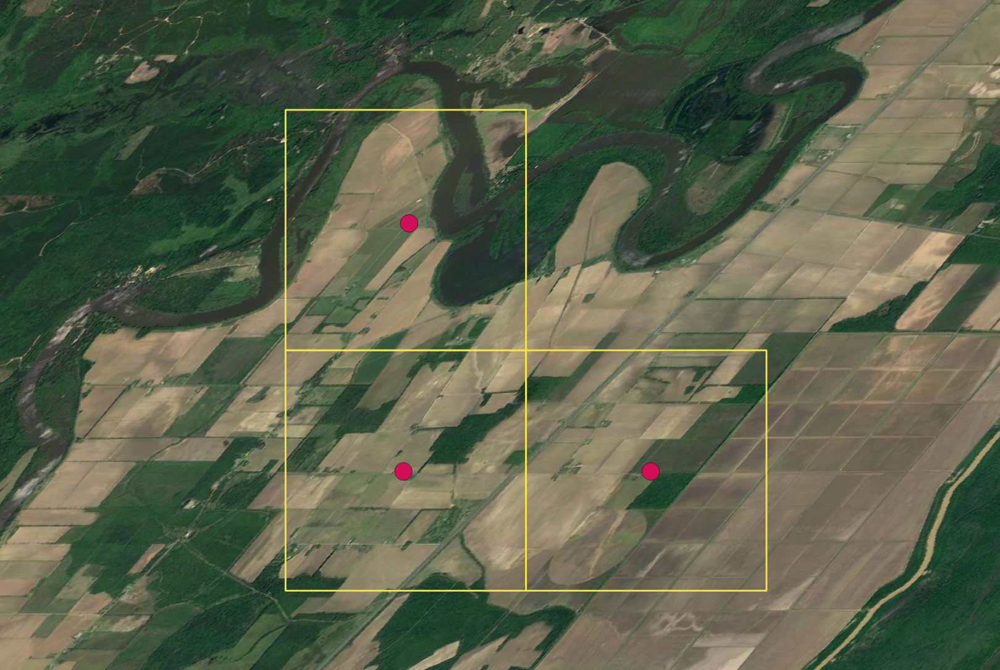

# 1. Access

With that background, I want to transition to a brief demonstration of accessing and using these data within R. Because of the format of this short workshop, i.e. Zoom and a large number of participants, this is going to be a demonstration rather than an interactive workshop. You're not meant to following along with the code, but I will stop for questions and all the notes and code are online, so you can work through them after at your own pace.

[eBird Status and Trends](https://ebird.org/science/status-and-trends) provides modeled estimates of the distribution and relative abundance of 610 North American breeding bird species over their full annual cycle at high spatial and temporal resolution. All the data behind the maps you've seen online, and in Orin's presentation, are freely and openly available, hosted by the [Registry of Open Data on AWS](https://registry.opendata.aws/ebirdst/). In addition to being able to download the data from AWS, we maintain the `ebirdst` R package for easily accessing and working with these data. In this first lesson, I'll show you how to access these data, load them into your R session, and make a simple map.

```{r site-libraries}
library(ebirdst)
library(raster)
library(sf)
library(rnaturalearth)
library(dplyr)
library(ggplot2)
```

The `ebirdst_runs` object is a data frame listing all the available species.

```{r species}
glimpse(ebirdst_runs)
View(ebirdst_runs)
```

Also in this data frame are seasonal dates, which are defined through a process of expert review of the weekly Status and Trends maps and define the start and end weeks of each of the following seasons. We'll see an example of how to use these in the coming applications.

The function `ebirdst_download()` downloads data for a single species from AWS. All you need to do is provide the name (common name, scientific name, or species code) of the species you want to download. For this example, I'll download the data for Loggerhead Shrike.

```{r dl-dl, eval = FALSE}
sp_path <- ebirdst_download(species = "Loggerhead Shrike")
sp_path
```

The function will automatically identify a suitable location to store the downloaded data and return that path, which we captured in the variable `sp_path`. By default, `ebirdst_download()` downloads just the raster predictions from Status and Trends for relative occurrence, count, and abundance. We can see the files downloaded with:

```{r dl-ls}
list.files(sp_path, recursive = TRUE)
```

Now that we've downloaded the data, let's load these data into our R session. These are raster data (i.e. estimates are provided over a regular grid) and therefore we'll need the `raster` package (loaded above) to work with them. There are a variety of layers available, but let's load the relative abundance estimates. To learn about some of the other layers, consult the [associated vignette](https://cornelllabofornithology.github.io/ebirdst/articles/ebirdst-introduction.html#raster-data-1) from the `ebirdst` package.

```{r load-abd}
abd <- load_raster(product = "abundance", path = sp_path)
abd
```

This is a `RasterStack` object with 52 layers, each providing a relative abundance estimate for a single week of the year. To see the dates corresponding to the midpoint of these weeks, use:

```{r load-dates}
parse_raster_dates(abd)
```

We can extract data for a single week, e.g. the 20th week centered on May 17, 2018, with:

```{r load-one}
abd[[20]]
```

Let's map a quick map of the May 17 abundance data to see what it looks like. The function `abundance_palette()` gives us access to the color palettes used in the online versions of the maps.

```{r map-simple}
par(mar = c(0, 0, 0, 0))
plot(abd[[20]], axes = FALSE, box = FALSE,
     col = abundance_palette(100, season = "weekly"), 
     maxpixels = ncell(abd))
```

Notice three failings with this map: 
- Extreme distortion in the continents 
- Most of this map is taken up by areas where the species doesn't occur, e.g. South America 
- There isn't much resolution in the color palette in areas where it does occur

These raster layers are provided for the entire Western Hemisphere in a sinusoidal equal area projection. This format ensures consistency across the full set of Status and Trends species, but isn't ideal for mapping the data for a single species. To address this, each Status and Trends data package comes with a set of parameters suitable for mapping the data for that species. Let's reproduce the above map using the provided extent, projection, and legend bins.

```{r map-pars}
# load mapping parameters
map_pars <- load_fac_map_parameters(sp_path)

# crop and reproject abundance raster
abd_proj <- abd[[20]] %>% 
  crop(map_pars$fa_extent_sinu) %>% 
  projectRaster(crs = map_pars$custom_projection, method = "ngb")

# map
par(mar = c(0, 0, 0, 0))
pal <- abundance_palette(length(map_pars$abundance_bins), season = "weekly")
plot(abd_proj, 
     breaks = c(0, map_pars$abundance_bins), 
     col = c("#e6e6e6", pal), 
     axes = FALSE, box = FALSE,
     maxpixels = ncell(abd_proj))
```

# 2. Site-selection

We've just seen how to download [eBird Status and Trends](https://ebird.org/science/status-and-trends) data and load weekly estimates of relative abundance into R for further analysis. In this lesson, I want to demonstrate one common application of these data: identifying sites of high importance for a species of conservation concern. We'll perform this site-selection at two spatial scales.

```{r site-libraries}
library(ebirdst)
library(raster)
library(sf)
library(rnaturalearth)
library(dplyr)
library(ggplot2)
```

Specifically, I want to identify important sites for Loggerhead Shrike during the **breeding** season. Recall from the previous lesson, that Status and Trends data are provided as weekly estimates and we can access predefined seasonal boundary dates from the `ebirdst_runs` data frame.

```{r seasonal-runs}
logshr_run <- filter(ebirdst_runs, common_name == "Loggerhead Shrike")
start_dt <- logshr_run$breeding_start_dt
end_dt <- logshr_run$breeding_end_dt
c(start_dt, end_dt)
```

We could subset the weekly relative abundance `RasterStack` to just the breeding season weeks, then average across the weeks. However, as a shortcut, the `ebirdst` package provides pre-calculated seasonal raster layers, which we can access with `load_raster()`.

```{r seasonal-load}
# find the location of the data we downloaded in the previous lesson
sp_path <- get_species_path("Loggerhead Shrike")
# load the seasonal rasters
abd <- load_raster("abundance_seasonal", sp_path)
abd
# subset to just the breeding season
abd_breeding <- abd[["breeding"]]
abd_breeding
```

This layer represents the expected relative abundance of Loggerhead Shrike during the breeding season on a standard eBird checklist.

Let's crop and re-project based on the species specific map parameters.

```{r seasonal-crop}
# load mapping parameters
map_pars <- load_fac_map_parameters(sp_path)

# crop and reproject abundance raster
abd_breeding_proj <- abd_breeding %>% 
  crop(map_pars$fa_extent_sinu) %>% 
  projectRaster(crs = map_pars$custom_projection, method = "ngb")
```

## Range-wide Site Selection

To perform a range-wide site selection, we'll identify the locations with the top 5% of non-zero abundance values across the entire range and visualize those locations.

```{r rangewide-quantile}
# remove zeroes prior to calculating quantiles
abd_breeding_proj[abd_breeding_proj == 0] <- NA
# calculate the 95th quantile
q95 <- quantile(abd_breeding_proj, na.rm = TRUE, probs = 0.95)
# identify top 5% of cells
abd_top5 <- abd_breeding_proj >= q95
```

We can map the selected sites with:

```{r rangewide-map}
par(mar = c(0, 0, 0, 0))
plot(abd_top5, col = c('#d9d9d9', '#fd8d3c'), 
     axes = FALSE, box = FALSE,
     maxpixels = ncell(abd_top5))
```

## Local Selection

Let's transition from broad-scale, region-wide site selection to a local site selection exercise. For example, let's consider a land trust working in Louisiana trying to identify important sites for Loggerhead Shrike. To start, we'll get a boundary polygon for Louisiana.

```{r local-la}
# get spatial boundary for louisiana
la <- ne_states(iso_a2 = "US", returnclass = "sf") %>% 
  filter(name == "Louisiana") %>% 
  # project
  st_transform(crs = map_pars$custom_projection)
```

We can identify the quartiles of the abundance data within Louisiana, essentially dividing the cells within the state into four equally sized groups.

```{r local-quarters}
# mask to louisiana
abd_breeding_la <- trim(mask(abd_breeding_proj, la))

# calculate abundance quartiles
quarters <- quantile(abd_breeding_la, probs = c(0.25, 0.5, 0.75, 1))

# map
par(mar = c(0, 0, 0, 0))
plot(abd_breeding_la, 
     breaks = c(0, quarters), col = abundance_palette(4, season = "weekly"),
     maxpixels = ncell(abd_breeding_la),
     box = FALSE, axes = FALSE)
plot(st_geometry(la), add = TRUE)
```

We could stop here, but when using these abundance rasters at a local scale, it's important to be cautious because the modeling was conducted at quite a broad spatial scale. As with any modeled estimates, these abundance estimates have uncertainty associated with them. One approach to dealing with this is to use the spatial estimates of uncertainty (the 10th and 90th quantiles of relative abundance) to assess if locations that we're considering for selection have overlapping confidence intervals.

```{r local-uncertainty-load}
# load the upper and lower confidence intervals
abd_upper <- load_raster("abundance_upper", path = sp_path)
abd_lower <- load_raster("abundance_lower", path = sp_path)

# subset to breeding season in louisiana
la_breeding_season <- ebirdst_extent(la, c(start_dt, end_dt))
abd_upper_br <- ebirdst_subset(abd_upper, la_breeding_season)
abd_lower_br <- ebirdst_subset(abd_lower, la_breeding_season)

# average for the breeding season and project
abd_upper_br_avg <- calc(abd_upper_br, fun = mean, na.rm = TRUE) %>% 
  projectRaster(crs = map_pars$custom_projection,
                method = "ngb")
abd_lower_br_avg <- calc(abd_lower_br, fun = mean, na.rm = TRUE) %>% 
  projectRaster(crs = map_pars$custom_projection,
                method = "ngb")
```

Next, let's imagine we're considering three potential sites in northern Louisiana, one in each of the top three quartiles of abundance.

```{r local-uncertainty-pts}
# generate points and convert to spatial
pts <- data.frame(name = c("High", "Middle", "Low"),
                  lng = c(-92.0777, -92.1081, -92.1336),
                  lat = c(32.2624, 32.2624, 32.2882)) %>% 
  st_as_sf(coords = c("lng", "lat"), crs = 4326) %>% 
  st_transform(crs = st_crs(map_pars$custom_projection))
```

We can overlay these points on a zoomed-in version of the above quartile map.

```{r local-uncertainty-map}
plot(abd_breeding_la, 
     breaks = c(0, quarters), 
     col = abundance_palette(4, season = "weekly"), alpha = 0.75,
     ext = st_buffer(pts, 10000), 
     maxpixels = ncell(abd_breeding_la),
     box = FALSE, axes = FALSE)
plot(pts, pch = 21, bg = "red", col = "black", cex = 1, add = TRUE)
```

Note that they each falls within a different colored cell, i.e. they all belong to different quartiles. Let's look at the abundance and confidence intervals for each of these points.

```{r}
# extract raster values
pts$abd <- extract(abd_breeding_la, pts)
pts$lower <- extract(abd_lower_br_avg, pts)
pts$upper <- extract(abd_upper_br_avg, pts)

# plot the confidence intervals for the three points
ggplot(pts, aes(y = abd, x = name)) +
  geom_point() + 
  geom_errorbar(aes(ymin = lower, ymax = upper)) +
  labs(x = "Location", y = "Relative Abundance",
       title = "Confidence intervals for locations")
```

One additional way to check the results of a site selection exercise is to ground truth the results using satellite imagery for the region in question.



# 3. Multi-species Temporal Trajectories

In this final lesson, I want to touch on two things we haven't seen examples of yet: comparing data across multiple species and the temporal component of these data. The goal will be to look at how populations of a suite of shorebirds in Kansas change over the course of the year.

Comparing Status and Trends results between species requires extra caution because the models give *relative* rather than absolute abundance. For example, species differ in their detectability, and this may cause in differences in relative abundance. To address this, we'll convert relative abundance to a proportion of population metric for each species by dividing the abundance layer by the total abundance summed across the entire range. For any given cell, this gives the proportion of relative abundance occurring in that cell.

```{r traj-libraries}
library(ebirdst)
library(raster)
library(sf)
library(rnaturalearth)
library(tidyverse)
library(parallel)
extract <- raster::extract
```

For this example, we'll be looking at a suite of shorebird species in Kansas, so let's also get a boundary polygon for that state.

```{r traj-boundary}
ks <- ne_states(iso_a2 = "US", returnclass = "sf") %>% 
  filter(name == "Kansas")
```

We begin by downloading data for a suite of 7 shorebird species that all spend at least a portion of the year within Kansas.

```{r data-dl, eval = FALSE}
species <- c("American Avocet", "Snowy Plover", "Hudsonian Godwit", 
             "Willet", "Marbled Godwit", "Sanderling", 
             "Semipalmated Sandpiper")
# sp_dirs <- map_chr(species, ebirdst_download) %>%
#   setNames(species)
sp_dirs <- map_chr(species, get_species_path) %>% 
  setNames(species)
```

Our goal is to produce trajectories comparing the proportion of each species' population within Kansas for each week of 2018. To do this, for each species we need to:

1.  Sum up the abundance across all cells within Kansas for each week
2.  Sum the abundance across the entire range of the species for each week
3.  Calculate the proportion of the population in Kansas, i.e. divide (1) by (2)

The below function performs these steps for a given species. Iterating over the full set of species is fairly computationally intensive, taking about 20 minutes on a laptop.

```{r traj-pop-process, eval = FALSE}
calculate_trajectory <- function(x, common_name, region) {
  message(names(x))
  # load and project weekly abundance
  abd <- load_raster("abundance", path = x)
  
  # total abundance within region
  r <- st_transform(region, crs = st_crs(abd))
  abd_region <- abd %>% 
    crop(r) %>% 
    extract(r, fun = sum)
  abd_region <- abd_region[1, , drop = TRUE]
  
  # calculate total range-wide abundance
  abd_total <- mclapply(seq.int(nlayers(abd)),
                        function(i) cellStats(abd[[i]], sum),
                        mc.preschedule = TRUE, mc.set.seed = TRUE, 
                        mc.cores = detectCores()) %>% 
    unlist()
  
  data.frame(common_name = common_name,
             date = parse_raster_dates(abd),
             prop_pop = abd_region / abd_total,
             row.names = NULL)
}
trajectories <- map2_dfr(sp_dirs, names(sp_dirs), 
                         calculate_trajectory,
                         region = ks)
```

To save time I'm going to load in pre-calculated data.

```{r traj-pop-load}
trajectories <- read_csv("../data/shorebird_pop-trajectories.csv", 
                         col_types = cols())
trajectories
```

Now we can plot these trajectories for the set of shorebird species.

```{r traj-traj}
ggplot(trajectories, aes(date, prop_pop, color = common_name)) +
  geom_line() +
  labs(x = "Week", 
       y = "Proportion of Population in Kansas",
       color = NULL) +
  theme(legend.position = "bottom")
```

Finally, we can combine these 7 trajectories into a single trajectory giving an estimate of the richness of this group of shorebirds throughout the year.

```{r traj-rich}
# calculate species richness
richness <- trajectories %>% 
  group_by(date) %>%
  summarise(n_species = n_distinct(common_name[prop_pop != 0]),
            .groups = "drop")

# plot richness
ggplot(richness, aes(date, n_species)) +
  geom_line() +
  labs(x = "Week", y = "Richness")
```
